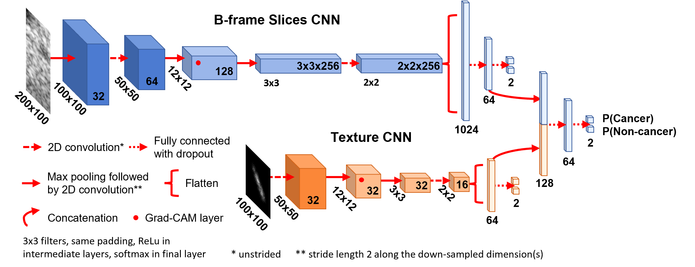

# Deep learning-based optical coherence tomography image analysis of human brain cancer
**Please cite as:** \
*Nathan Wang, Cheng-Yu Lee, Hyeon-Cheol Park, David W. Nauen, Kaisorn L. Chaichana, Alfredo Quinones-Hinojosa, Chetan Bettegowda, and Xingde Li, "Deep learning-based optical coherence tomography image analysis of human brain cancer," Biomed. Opt. Express 14, 81-88 (2023) \
[read here](https://opg.optica.org/boe/fulltext.cfm?uri=boe-14-1-81&id=522789)*

For dataset requests, please contact Prof. Xingde Li at xingde@jhu.edu. \
For other questions, please also contact Nathan Wang at swang279@jhu.edu.

**Table of Contents:**
1. [Abstract](#abstract)
2. [Model Architecture](#model-architecture)
3. [Quick Setup](#quick-setup)
4. [Content Description](#content-description)

## Abstract
Real-time intraoperative delineation of cancer and non-cancer brain tissues, especially in the eloquent cortex, is critical for thorough cancer resection, lengthening survival, and improving quality of life. Prior studies have established that thresholding optical attenuation values reveals cancer regions with high sensitivity and specificity. However, threshold of a single value disregards local information important to making more robust predictions. Hence, we propose deep convolutional neural networks (CNNs) trained on labeled OCT images and co-occurrence matrix features extracted from these images to synergize attenuation characteristics and texture features. Specifically, we adapt a deep ensemble model trained on 5,831 examples in a training dataset of 7 patients. We obtain 93.31% sensitivity and 97.04% specificity on a holdout set of 4 patients without the need for beam profile normalization using a reference phantom. The segmentation maps produced by parsing the OCT volume and tiling the outputs of our model are in excellent agreement with attenuation mapping-based methods. Our new approach for this important application has considerable implications for clinical translation.

## Model Architecture



**Fig. 2.** Ensemble learning architecture integrating B-frame slice pixels and texture features
for OCT cancer tissue analysis. The dimension of each layer is indicated, where the two
dimensions outside each layer are the feature map shape and the number inside each layer is
the number of maps/filters. The B-frame Slices CNN and Texture CNN are trained separately.
Once they have converged, they are used to create embeddings of their respective inputs,
which are linked to a fully connected network that makes the final classification.

## Quick Setup

```
conda create --name my_env pip python=3.9
conda activate my_env
conda install -c conda-forge cudatoolkit=11.2 cudnn=8.1.0
cd path\to\brain_cancer_oct
pip install -r requirements.txt
```

*Note: As of 09/13/23, only TensorFlow version <2.11, which requires Python <=3.9, is GPU-enabled. Please refer to the [official instructions](https://www.tensorflow.org/install/pip) for up to date compatability details.*

Once the dataset has been requested and organized according to the structure in [Content Description](#content-description) below, you can run the **train_neural_networks.ipynb** and **analyze_neural_networks.ipynb** notebooks to replicate our results.

## Content Description

- **[manuscript/](manuscript):** original figures and iterations of the published manuscript
- **[margin_data/](margin_data):\*** OCT scan of tumor margin tissues (mixed cancer and non-cancer regions) 
- **[project_scripts/](project_scripts):** contains functions and objects that are imported into the Jupyter notebooks, where the training and analysis is performed
    - **data_loading.py:** defines scripts for loading data
    - **neural_networks.py:** defines the neural network models as classes
    - **pre-processing.py:** defines functions to pre-process data
    - **widgets.py:** defines widgets for visualizing data and results
- **[saved_models/](saved_models):** trained TensorFlow models that can be loaded for inference
    - **final_models/:** trained models that are used to produce the results in the manuscript
        - bframe_cnn/
        - texture_cnn/
        - ensemble_mlp/
    - **models_history/:** models saved by the callback during training. Probably won't be useful to you.
        - ...
- **[testing_data/](testing_data):\*** OCT scan testing dataset from _ patients
    - cancer/
    - non_cancer/
- **[training_data/](training_data):\*** OCT scan training dataset from _ patients
    - cancer/
    - non_cancer/
- **analyze_neural_networks.ipynb:** Python notebook for analyzing the neural network performance
- **train_neural_networks.ipynb:** Python notebook for training the neural networks

**\*** Please request these data from Prof. Xingde Li at xingde@jhu.edu

## 